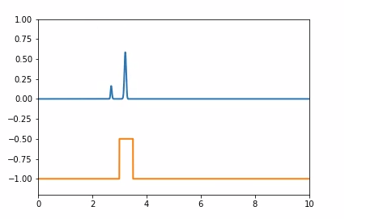

# Pemodelan-BreakWater-dengan-metode-Lax
Simulasi ini merupakan project untuk menganalisis pengaruh tinggi dan lebar pada breakwater (pemecah ombak) pada gelombang

Dengan menggunakan metode Lax 
 
dengan model yang digunakan untuk simulasi yaitu pengembangan dari Shallow Water Equations (SWE) 

Yang diselesaikan dengan metode beda hingga dari metode FTCS yaitu metode LAX

Berikut adalah poster yang saya buat : 

